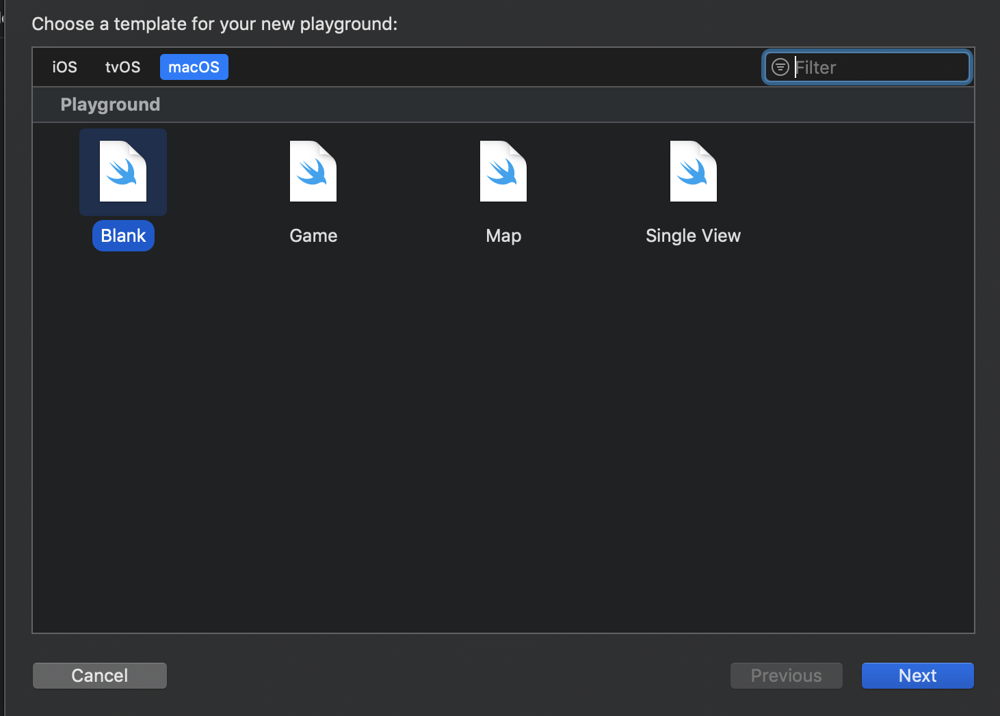
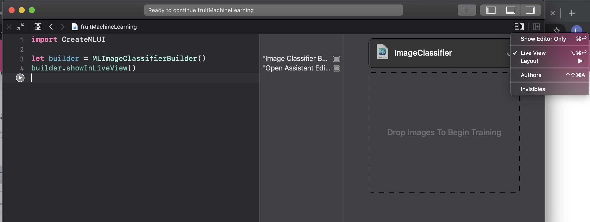
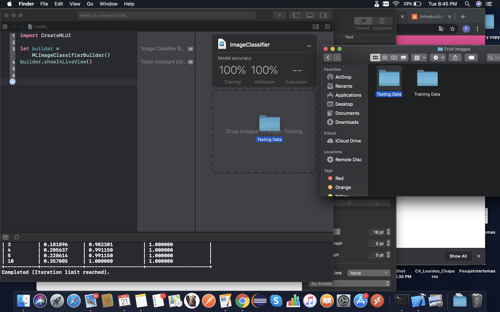
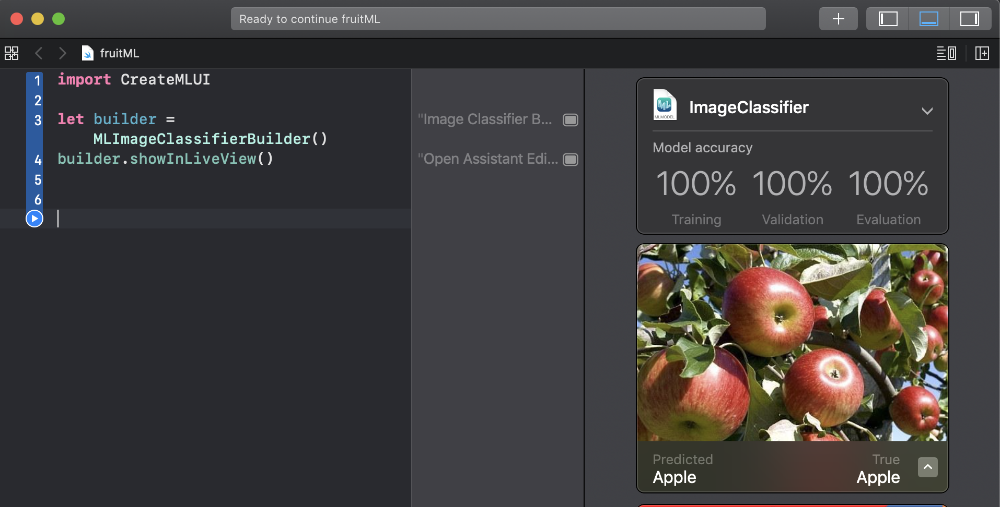
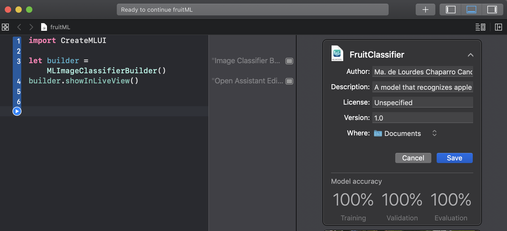
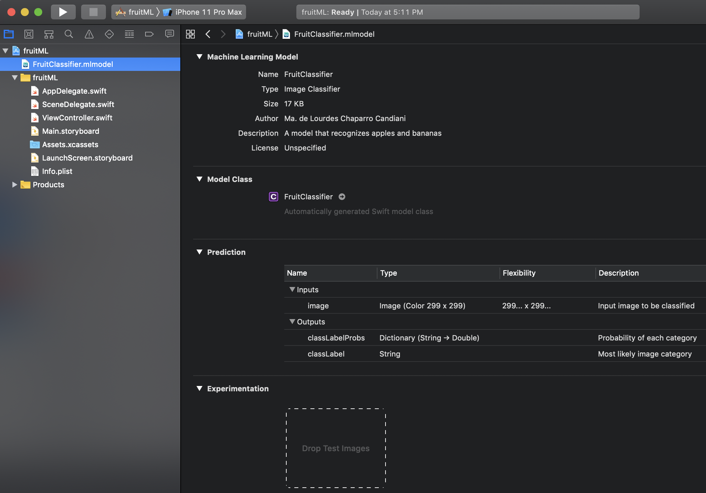

# Inteligencia Artificial en iOS

- [Conceptos Básicos](#conceptos-básicos)

- [CreateML](#createml)

- [Ejemplo CreateML](#cómo-crear-un-modelo-utilizando-createml)

- [CoreML](#coreml)

- [Ejemplo de CoreML](#cómo-integrar-un-modelo-utilizando-coreml)

___

## Conceptos Básicos

#### Inteligencia Artificial
Consiste en el desarrollo de sistemas computacionales capaces de llevar a cabo tareas que normalmente requieren inteligencia humana; tales como percepción visual, reconocimiento de lenguaje, toma de decisiones y traducción, entre otros.

#### Machine Learning 
Es una manera de aplicar la Inteligencia Artificial que provee a los sistemas con la habilidad de aprender automáticamente y tener mejoras continuas basadas en la experiencia sin ser explícitamente programados.

#### Modelo
Un modelo en “Machine Learning” consiste en la representación matemática de un proceso en la vida real. Para generar un modelo se necesita proveer datos de entrenamiento a un algoritmo para que pueda aprender de ellos.

___

## CreateML
Consiste en un framework que nos brinda Apple para poder crear y entrenar modelos de machine learning utilizando herramientas familiares como Swift y los playgrounds de Xcode.
Se entrena un modelo para reconocer patrones, mostrándole ejemplos representativos. Después de entrenar el modelo, se prueba con datos que no se le han mostrado previamente y se evalúa su desempeño al realizar esta tarea.
Cuando el desempeño del modelo es suficientemente bueno se puede integrar en una aplicación por medio de [CoreML](#coreml).

## Cómo crear un modelo utilizando CreateML
En este ejemplo generaremos un modelo que sepa clasificar imágenes en dos categorías: manzanas y plátanos.  
Necesitamos crear dos conjuntos de imágenes, uno para entrenar el modelo (Training Data) y otro para probarlo (Testing Data); los cuales a su vez estarán divididos en plátanos (Banana) y manzanas (Apple). Se recomienda tener una división del 80% de datos para entrenar y 20% para probar.
Una vez que se tienen listos los datos, creamos un nuevo Playground seleccionando las opciones “macOS” y “Blank”.




Nombrar y crear el Playground e ingresar el código:

```swift
import CreateMLUI
 
let builder = MLImageClassifierBuilder()
builder.showInLiveView()
```

Por medio de la clase MLImageClassifierBuilder instanciamos un clasificador de imágenes que entrenaremos a través del Playground.

1. Activar “Live View” para que se muestre la interfaz gráfica.


2. Arrastrar carpeta “Training Data” hacia el área asignada por la interfaz.

 
3. Arrastrar carpeta “Testing Data” hacia el área asignada por la interfaz.


Al finalizar el procesamiento de los datos se muestra una tabla con 3 porcentajes (Training, Validation y Evaluation). “Training” nos indica el porcentaje de imágenes que el modelo ha podido utilizar para el entrenamiento de manera exitosa, “Validation” nos muestra el porcentaje de imágenes que el clasificador acertó (con respecto a un subconjunto que Xcode separa de los datos de entrenamiento “Training Data”) y finalmente “Evaluation” nos muestra el porcentaje de imágenes que el clasificador acertó pero del conjunto que se designó desde un inicio para probar (Testing Data).


4. Modificar los datos del modelo (nombre, autor, metadatos, ubicación) y guardarlo.

___

## CoreML

Framework de Apple para machine learning, que nos permite integrar en nuestras aplicaciones modelos previamente entrenados.
Los modelos creados con CreateML se encuentran ya en formato para ser utilizados por CoreML. Pero también se pueden utilizar modelos de otros orígenes, siempre y cuando se conviertan al formato adecuado por medio de las Core ML Tools.

## Cómo integrar un modelo utilizando CoreML

Arrastrar nuestro modelo dentro del proyecto.



Dentro del ViewController integrar el siguiente código:

```swift
import CoreML

Class ViewController: UIViewController {

//Utilizar nombre del modelo importado
var model: FruitClassifier! 
 
override func viewWillAppear(_ animated: Bool) {
    model = FruitClassifier()
}

//Código para capturar la imagen y convertirla al formato recibido por el modelo

guard let prediction = try? model.prediction(image: pixelBuffer!) else {
    return
}

classifier.text = "I think this is a \(prediction.classLabel).”

}
```

Podemos observar que en la variable “model” creamos una instancia del modelo que entrenamos previamente para la clasificación de manzanas y plátanos.

Posteriormente utilizamos el método “prediction”, el cual recibe una imagen y la clasifica de acuerdo al entrenamiento brindado al modelo.
Finalmente mostramos el resultado de la predicción obtenida por medio de la etiqueta “classifier”.

Este ejemplo sólo contiene las líneas de código necesarias para utilizar el modelo, para poder generar un proyecto funcional es necesario agregar la funcionalidad para la captura o el ingreso de la imagen, así como su procesamiento para cumplir con el formato requerido por el modelo (299 x 299 pixeles).

